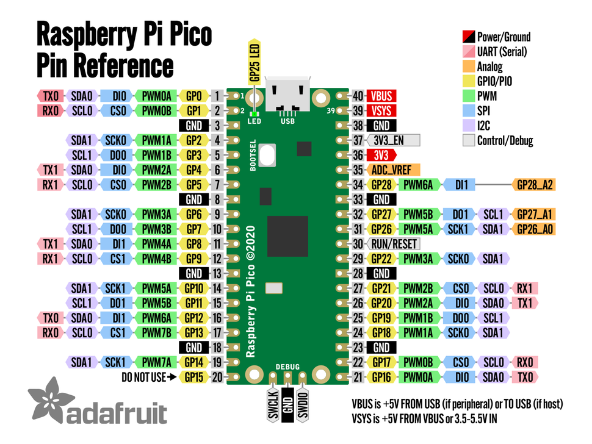

# MicroPython Workshop @ IPS 2024-11-06


---
# System setup:
(1) Instalar IDE )Thonny) usando o python
```bash
pip install thonny esptool --upgrade
```
or `pip3`


(2) Instalar `ampy` - utilitário de linha de comandos para upload/download de ficheiros para o microcontrolador
```bash
pip install adafruit-ampy --upgrade
```

Como usar AMPY:
```bash
ampy -ls
ampy -p COM1 put filename
```


Exemplo: `ampy -p COM3 put sensor_manager.mpy`


# Hardware

<table>
  <tr>
    <td><h3>Raspberry Pi Pico</h3>
    <td><h3>ESP32 PICO</h3>
    <td><h3>Wemos D1 mini</h3>
    </tr>
  <tr>
<td>
  <a target="hardware_board" href="../../pinout/raspberry-pi-pico-pinout-adafruit.png"></a>
<td>  
 <a target="hardware_board" href="../../pinout/ESP32-PICO-KIT.jpg"></a>
<td>
  <a target="hardware_board" href="../../pinout/WeMos-d1-mini-Pinout.png"></a>
<tr>
  <td><p style="font-size:14px; color:#555;">RP2040: 264Kb de SRAM; 2mb de flash</p>
  <td><p style="font-size:14px; color:#555;">ESP32: 520kb SRAM; 4mg de flask</p>
  <td><p style="font-size:14px; color:#555;">ESP8266: 64kb de RAM; 4md de flash</p>
</table>

---

## Demo 1a - Digital output - Blink
Nesta demonstração, aprendemos a controlar um LED utilizando o MicroPython, fazendo-o piscar em intervalos regulares. Este é um exercício fundamental para compreender o funcionamento das saídas digitais em microcontroladores.


```Python
# filename: demo1a_blink.py
from machine import Pin
from time import sleep
 
PIN_G = 10 # Green pin

pause = 1

led_g = Pin( PIN_G, Pin.OUT ) 

loops = 3
while loops > 0:
    led_g.on()
    sleep(pause)
    led_g.off()
    sleep(pause)
    loops = loops - 1 # comment this line to run forever
```

---


## Demo 1b - Digital output - Blink
Nesta demonstração, vamos expandir o conceito anterior de controle de saídas digitais, fazendo com que três LEDs (verde, amarelo e vermelho) pisquem em sequência. Este exercício é fundamental para compreender o controle de múltiplas saídas digitais em microcontroladores utilizando MicroPython.


```Python
# filename: demo1b_blink.py
from machine import Pin
from time import sleep
 
PIN_G = 10 # Green pin
PIN_Y = 11 # Yellow Pin
PIN_R = 12 # Red Pin
pause = 1
 
led_g = Pin( PIN_G, Pin.OUT )
led_y = Pin( PIN_Y, Pin.OUT )
led_r = Pin( PIN_R, Pin.OUT )
 
loops = 3
while loops > 0:
    led_g.on()
    sleep(pause)
    led_g.off()
    led_y.on()
    sleep(pause)
    led_y.off()
    led_r.on()
    sleep(pause)
    led_r.off()
    loops = loops - 1 # comment this line to run forever
```


---

## Demo 1c - Digital output - Blink
Nesta demonstração, aprimoramos o código anterior para controlo de múltiplos LEDs. Isso poderá facilitar a reutilização e manutenção, especialmente quando se lida com vários componentes.


```Python
# filename: demo1c_blink.py
from machine import Pin
from time import sleep
 
PINS = [10, 11, 12]
pause = 1

LEDS = [Pin(pin, Pin.OUT) for pin in PINS]
 
loops = 3
while loops > 0:
    for led in LEDS:
        for status in [1, 0]:
            led.value(status)
            sleep(pause * status)

    loops = loops - 1 # comment this line to run forever
```


---

## Demo 2a - Digital input - Button
Na Demonstração 2A: Entrada Digital - Botão, exploramos como ler o estado de um botão utilizando MicroPython. Este exercício é fundamental para compreender a interação entre entradas digitais e o microcontrolador.


```Python
# filename: demo2a_button.py
from machine import Pin
from time import sleep

PIN_G = 10 # Green pin
PIN_R = 11   # Red Pin
PIN_BTN = 14 

led_g = Pin( PIN_G, Pin.OUT )
led_r = Pin( PIN_R, Pin.OUT ) 
btn1 = Pin( PIN_BTN, Pin.IN )

led_g.on()
led_r.off()
last_value = 1
while True: 
    value = btn1.value()
    if value and value != last_value:
        led_g.value( not led_g.value() )
        led_r.value( not led_r.value() )
    last_value = value
    sleep( 0.1 )
```

---

## Demo 2b - Avoidance Sensor
Na Demonstração 2B: Entrada Digital - Sensor de Deteção de Obstáculos, substituímos o botão utilizado na demonstração anterior por um sensor de deteção de obstáculos. Este sensor detecta a presença de objetos próximos e envia um sinal digital ao microcontrolador, permitindo acionar um LED quando um obstáculo é detectado. 


```Python
# filename: demo2b_avoindance.py
from machine import Pin
from time import sleep_ms

PIN_G = 10 # to connect to the green led
PIN_R = 11 # to connect to the red led
PIN_SENSOR = 14 # to connect to the obstacle sensor

led_g = Pin( PIN_G, Pin.OUT )
led_r = Pin( PIN_R, Pin.OUT )
sensor = Pin( PIN_SENSOR, Pin.IN )

last_value = 0
while True:
    value = sensor.value()
    if value != last_value:
        led_g.value( value )
        led_r.value( not value )
    last_value = value
    sleep_ms( 10 )
```

---


## Demo 2c - PhotoGate
Na Demonstração 2C: Photogate, utilizamos o mesmo senosr para medir o tempo que um objeto leva para atravessar um feixe de luz, funcionando como um cronómetro de passagem. Este sistema é frequentemente empregado em laboratório de física para determinar velocidades e tempos de reação.


```Python
# filename: demo2c_photogate.py
from machine import Pin
from time import sleep_ms
from sensor_manager import PhotoGate

PIN_G = 10 # to connect to the green led
PIN_R = 11 # to connect to the red led
PIN_GATE = 14 # to connect to the obstacle sensor
PIN_GATE_MODE = 1 # 0 for always on | 1 for always off

led_g = Pin( PIN_G, Pin.OUT )
led_r = Pin( PIN_R, Pin.OUT )
gate1 = PhotoGate( PIN_GATE, mode=PIN_GATE_MODE )

while True:
    gate1.read()
    if gate1.event_change_to(1):
        gate1.start_time()
        led_g.value(0)
        led_r.value(1)
    if gate1.event_change_to(0):
        gate1.stop_time()
        led_g.value(1)
        led_r.value(0)
        print(gate1.millis)
    gate1.store()
```

---


## Demo 3a - Ultrasonic Sensor
Na Demonstração 3A: Sensor Ultrassónico, exploramos a utilização do sensor HC-SR04 para medir distâncias sem contacto físico, integrando-o com um microcontrolador compatível com MicroPython.
O sensor HC-SR04 emite um pulso ultrassónico e o microcontrolador mede o tempo que este leva a ser refletido de volta por um objeto, calculando assim a distância com base no tempo decorrido.


```Python
# filename: demo3a_ultrasonic.py
from machine import Pin
from time import sleep_ms
from sensor_manager import Sensor_HCSR04

LED_PINS = [10, 11, 12]
PIN_TRIGGER, PIN_ECHO = 16, 17

LEDS = [Pin(pin, Pin.OUT) for pin in LED_PINS]

sensor = Sensor_HCSR04(trigger=PIN_TRIGGER, echo=PIN_ECHO)

while True:
    sensor.read()
    d = sensor.distance_mm
    if d > 100:
        nleds = 0
    elif d > 50:
        nleds = 1
    else:
        nleds = 2
    
    for index, led in enumerate(LEDS):
        value = 1 if index == nleds else 0
        LEDS[index].value(value)
    sleep_ms(50)
```

---


## Demo 4a - i2c scan
Na Demonstração 4A: Varredura I2C, exploramos como identificar dispositivos conectados ao barramento I2C utilizando MicroPython. O protocolo I2C (Inter-Integrated Circuit) é amplamente utilizado para comunicação entre microcontroladores e periféricos, como sensores e displays.


```Python
# filename: demo4a_i2c_scan.py
from machine import Pin, I2C

i2c_sda = Pin(12)
i2c_scl = Pin(13)

# Initialize I2C
i2c = I2C(0,sda=i2c_sda,scl=i2c_scl,freq=100000)

# I2C-Bus-Scan
print('Scan I2C Bus...')
devices = i2c.scan()

# Output scan result 
if len(devices) == 0:
    print('No I2C-device found!')
else:
    print('I2C-devices found:', len(devices))
    for device in devices:
        print('Decimal address:', device, end = '')
        print('| Hexa Address:', hex(device))
```

---


## Demo 4b - import drivers
Na Demonstração 4B: Varredura I2C, exploramos como importar modulos (drivers) para comunicação com os dispositivos i2c. Neste caso, para integrar o sensor BME280 e o display OLED SSD1306 utilizando MicroPython, é necessário importar os módulos correspondentes que facilitam a comunicação com esses dispositivos. 


```Python
# filename: demo4b_i2c_drivers.py
from machine import Pin, I2C
from time import sleep
import gc

from ssd1306 import SSD1306_I2C
from bme280 import BME280

gc.enable()

i2c_sda = 12
i2c_scl = 13

i2c = I2C(0,sda=i2c_sda,scl=i2c_scl)
oled = SSD1306_I2C(128, 64, i2c, addr=0x3C)
sensor = BME280(i2c=i2c, address=0x76)

while True:
    t = sensor.temperature()
    p = sensor.pressure()
    h = sensor.humidity()
    oled.fill(0)  # Clear the display
    oled.rect(0,0,128,64,1)
    oled.text("Temp: {}C".format(round(t, 1)), 0, 8)
    oled.text("Press: {}hPa".format(round(p, 1)), 0, 24)
    oled.text("Hum: {}%".format(round(h, 0)), 0, 38)
    oled.show()
    sleep(1)
```

Drivers catalog:
* https://awesome-micropython.com/
* https://github.com/micropython/micropython-lib/tree/master/micropython/drivers/display/ssd1306
* https://github.com/kevbu/micropython-bme280/blob/master/bme280.py


---


## Demo 5a - internet
Na Demonstração 5A: Conexão à Internet, exploramos como conectar um microcontrolador compatível com MicroPython, como o ESP8266 ou ESP32, a uma rede Wi-Fi, permitindo a comunicação com a internet. Neste exemplo, ligamos e desligamos um led baseado no url acedido.


```Python
# filename: demo5a_internet.py
from machine import Pin
from time import sleep
import network, socket, gc
gc.enable()

led = Pin(10, Pin.OUT)

wlan = network.WLAN(network.STA_IF)
wlan.active(True)
wlan.connect('<Your SSID>', 'password')

print('Connecting', end='')
while not wlan.isconnected():
    led.toggle()
    print('.', end='')
    sleep(1)
print()
    
addr = (wlan.ifconfig()[0], 80)
s = socket.socket()
s.bind(addr)
s.listen(1)

print('Listening for connections on', addr)
html_body = '''
<html>
<head><title>Control LED</title></head>
<body>
<h1>{}</h1>
    <a href="/ON">Turn LED ON</a>
    <a href="/OFF">Turn LED OFF</a>
</body>
</html>
'''

led_status = {0: 'OFF', 1: 'ON'}
try:
    while True:
        cl, addr = s.accept()
        print('Client connected from', addr)
        request = cl.recv(1024)
        request = str(request)
        print('Request:', request)
        if '/favicon.ico' in request:
            cl.close()
            continue
            
        if 'GET /ON ' in request:
            value = 1
        elif 'GET /OFF ' in request:
            value = 0
        else:
            value = led.value()
        
        led.value(value)
        response = led_status.get(value)
        response = 'LED is ' + response
        
        cl.send('HTTP/1.0 200 OK\r\nContent-type: text/html\r\n\r\n')
        cl.send(html_body.format(response))
        cl.close()
        
        gc.collect()
except Exception as e:
    print('Error:', e)
finally:
    s.close()
    wlan.active(False)

```

---


## Demo 5b - MQTT
Na Demonstração 5B: Controle de LED via MQTT, exploramos como utilizar o protocolo MQTT para controlar remotamente um LED conectado a ao microcontrolador.


```Python
# filename: demo5b_mqtt.py
from time import sleep
import gc
gc.enable()

from machine import Pin
PIN_LED = 10
led = Pin(PIN_LED, Pin.OUT)


def reconnect():
    wlan_client.start()
    success = wlan_client.check() and mqtt_client.check()
    if success:
        mqtt_client.broker.subscribe(TOPIC_SUB)
    return success

from wlan_manager import WLAN_Manager
wlan_client = WLAN_Manager() # Connection to Internet
#wlan_client.setup("Your SSID", "password")
wlan_client.start()


def mqtt_callback(topic, msg):
    print('MSG! Topic: {}; Data {}'.format(topic, msg))  
    if msg == b'LED ON':
        led.value(1)
    elif msg == b'LED OFF':
        led.value(0)
    elif msg == b'STATUS':
        status = {0: 'LED is OFF', 1: 'LED is OFF'}.get(led.value(), 0)
        try:
            mqtt_client.send(TOPIC_PUB, status)
        except:
            print('MQTT send failed!')

    return True

from mqtt_manager import MQTT_Manager
mqtt_client = MQTT_Manager()
#mqtt_client.setup()

# Global variables
TOPIC_SUB = mqtt_client.get_topic("control") # You talking to the sensor
TOPIC_PUB = mqtt_client.get_topic("status")  # The sensor talking to you
chatty_client =  bool(mqtt_client.CONFIG.get("chatty", True))
mqtt_client.broker.set_callback(mqtt_callback)

print( "client_id:", mqtt_client.CONFIG["client_id"] )
print( "MQTT SUB:", TOPIC_SUB)
print( "MQTT PUB:", TOPIC_PUB)


# Main Loop
connected = reconnect()
gc.collect()
while True:
    connected = mqtt_client.check_msg()
    if not connected:
        connected = reconnect()
    sleep(1)
```

> [!NOTE]
> (0) First time using this code, `wlan_client.setup()` and `mqtt_client.setup()` must be used.

(1) Open MQTT web client 
<a href="https://www.hivemq.com/demos/websocket-client/" target="_blank">Hive MQTT Client</a>

(2) choose "Connect" and then "Add New Topic Subscription":
* to control: ips/devices/rp2_e6626005a7936e28/control
* to check status: ips/devices/rp2_e6626005a7936e28/status

(3) To send a command, choose "Publish" to the control topic
* Valid commands: `LED ON`, `LED OFF` or `STATUS`

---
Extra tools:
* https://github.com/jpedrodias/MicroPython
  * sensor_manager
  * wlan_manager
  * mqtt_manager
---
