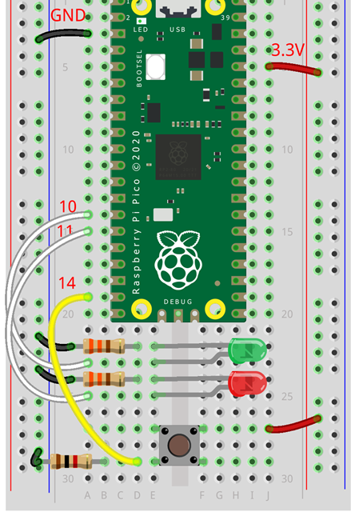
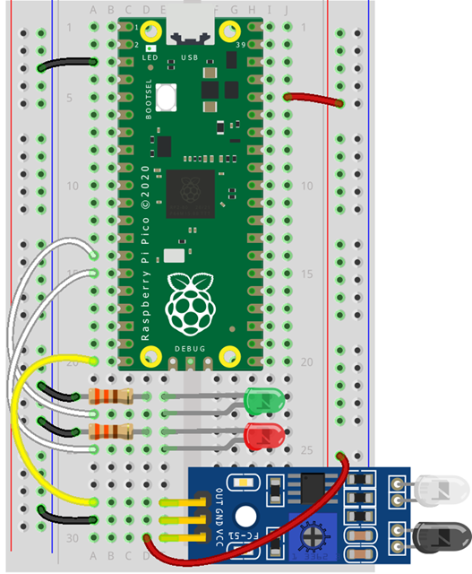
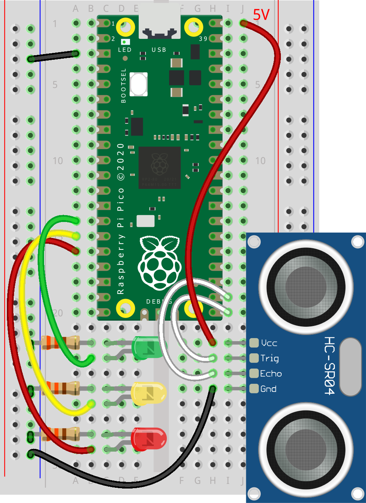
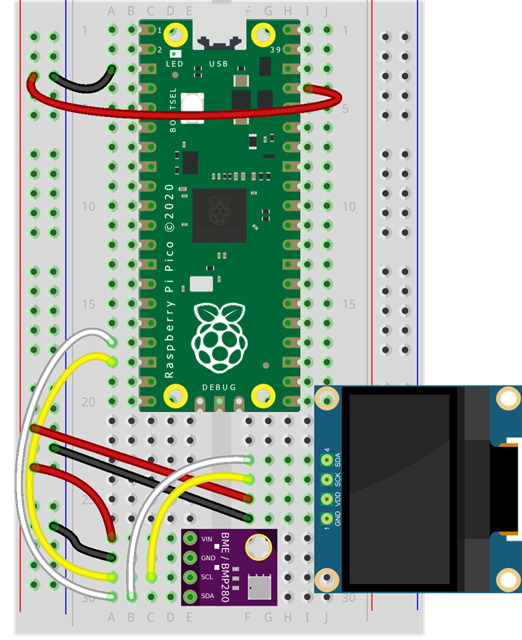

# MicroPython Workshop - 2024-11-06 @ ISP


## Demo 1a - Digital output - Blink


```Python:
# filename: demo1a_blink.py
from machine import Pin
from time import sleep
 
PIN_G = 10 # Green pin

pause = 1

led_g = Pin( PIN_G, Pin.OUT ) 

loops = 3
while loops > 0:
    led_g.on()
    sleep(pause)
    led_g.off()
    sleep(pause)
    loops = loops - 1 # comment this line to run forever
```

---


## Demo 1b - Digital output - Blink


```Python:
# filename: demo1b_blink.py
from machine import Pin
from time import sleep
 
PIN_G = 10 # Green pin
PIN_Y = 11 # Yellow Pin
PIN_R = 12 # Red Pin
pause = 1
 
led_g = Pin( PIN_G, Pin.OUT )
led_y = Pin( PIN_Y, Pin.OUT )
led_r = Pin( PIN_R, Pin.OUT )
 
loops = 3
while loops > 0:
    led_g.on()
    sleep(pause)
    led_g.off()
    led_y.on()
    sleep(pause)
    led_y.off()
    led_r.on()
    sleep(pause)
    led_r.off()
    loops = loops - 1 # comment this line to run forever
```


---

## Demo 1c - Digital output - Blink


```Python:
# filename: demo1c_blink.py
from machine import Pin
from time import sleep
 
PINS = [10, 11, 12]
pause = 1

LEDS = [Pin(pin, Pin.OUT) for pin in PINS]
 
loops = 3
while loops > 0:
    for led in LEDS:
        for status in [1, 0]:
            led.value(status)
            sleep(pause * status)

    loops = loops - 1 # comment this line to run forever
```


---

## Demo 2a - Digital input - Button


```Python:
# filename: demo2a_button.py
from machine import Pin
from time import sleep

PIN_G = 10 # Green pin
PIN_R = 11   # Red Pin
PIN_BTN = 14 

led_g = Pin( PIN_G, Pin.OUT )
led_r = Pin( PIN_R, Pin.OUT ) 
btn1 = Pin( PIN_BTN, Pin.IN )

led_g.on()
led_r.off()
last_value = 1
while True: 
    value = btn1.value()
    if value and value != last_value:
        led_g.value( not led_g.value() )
        led_r.value( not led_r.value() )
    last_value = value
    sleep( 0.1 )
```

---

## Demo 2b - Avoidance Sensor


```Python:
# filename: demo2b_avoindance.py
from machine import Pin
from time import sleep_ms

PIN_G = 10 # to connect to the green led
PIN_R = 11 # to connect to the red led
PIN_SENSOR = 14 # to connect to the obstacle sensor

led_g = Pin( PIN_G, Pin.OUT )
led_r = Pin( PIN_R, Pin.OUT )
sensor = Pin( PIN_SENSOR, Pin.IN )

last_value = 0
while True:
    value = sensor.value()
    if value != last_value:
        led_g.value( value )
        led_r.value( not value )
    last_value = value
    sleep_ms( 10 )
```

---


## Demo 2c - PhotoGate


```Python:
# filename: demo2c_photogate.py
from machine import Pin
from time import sleep_ms
from sensor_manager import PhotoGate

PIN_G = 10 # to connect to the green led
PIN_R = 11 # to connect to the red led
PIN_GATE = 14 # to connect to the obstacle sensor
PIN_GATE_MODE = 1 # 0 for always on | 1 for always off

led_g = Pin( PIN_G, Pin.OUT )
led_r = Pin( PIN_R, Pin.OUT )
gate1 = PhotoGate( PIN_GATE, mode=PIN_GATE_MODE )

while True:
    gate1.read()
    if gate1.event_change_to(1):
        gate1.start_time()
        led_g.value(0)
        led_r.value(1)
    if gate1.event_change_to(0):
        gate1.stop_time()
        led_g.value(1)
        led_r.value(0)
        print(gate1.millis)
    gate1.store()
```

---


## Demo 3a - Ultrasonic Sensor


```Python:
# filename: demo3a_ultrasonic.py
from machine import Pin
from time import sleep_ms
from sensor_manager import Sensor_HCSR04

LED_PINS = [10, 11, 12]
PIN_TRIGGER, PIN_ECHO = 16, 17

LEDS = [Pin(pin, Pin.OUT) for pin in LED_PINS]

sensor = Sensor_HCSR04(trigger=PIN_TRIGGER, echo=PIN_ECHO)

while True:
    sensor.read()
    d = sensor.distance_mm
    if d > 100:
        nleds = 0
    elif d > 50:
        nleds = 1
    else:
        nleds = 2
    
    for index, led in enumerate(LEDS):
        value = 1 if index == nleds else 0
        LEDS[index].value(value)
    sleep_ms(50)
```

---


## Demo 4a - i2c scan


```Python:
# filename: demo4a_i2c_scan.py
from machine import Pin, I2C

i2c_sda = Pin(12)
i2c_scl = Pin(13)

# Initialize I2C
i2c = I2C(0,sda=i2c_sda,scl=i2c_scl,freq=100000)

# I2C-Bus-Scan
print('Scan I2C Bus...')
devices = i2c.scan()

# Output scan result 
if len(devices) == 0:
    print('No I2C-device found!')
else:
    print('I2C-devices found:', len(devices))
    for device in devices:
        print('Decimal address:', device, end = '')
        print('| Hexa Address:', hex(device))
```

---


## Demo 4b - import drivers


```Python:
# filename: demo4b_i2c_drivers.py
from machine import Pin, I2C
from time import sleep
import gc

# https://github.com/micropython/micropython-lib/blob/master/micropython/drivers/display/ssd1306/ssd1306.py
from ssd1306 import SSD1306_I2C

# https://github.com/kevbu/micropython-bme280/blob/master/bme280.py
from bme280 import BME280

gc.enable()

i2c_sda = 12
i2c_scl = 13

i2c = I2C(0,sda=i2c_sda,scl=i2c_scl)
oled = SSD1306_I2C(128, 64, i2c, addr=0x3C)
sensor = BME280(i2c=i2c, address=0x76)

while True:
    t = sensor.temperature()
    p = sensor.pressure()
    h = sensor.humidity()
    oled.fill(0)  # Clear the display
    oled.rect(0,0,128,64,1)
    oled.text("Temp: {}C".format(round(t, 1)), 0, 8)
    oled.text("Press: {}hPa".format(round(p, 1)), 0, 24)
    oled.text("Hum: {}%".format(round(h, 0)), 0, 38)
    oled.show()
    sleep(1)
```

---

